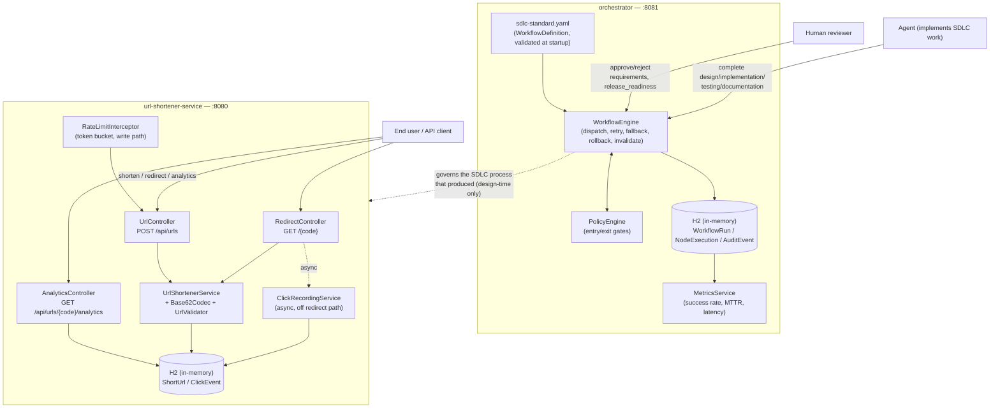
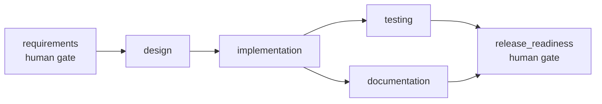

# URL Shortener — Agentic SDLC Orchestration Engine

[]()
[]()
[]()
[]()
[]()
[]()
[]()

> A DAG-based, stateful workflow engine that governs the software development lifecycle
> — requirements → design → implementation → parallel testing/documentation →
> release-readiness — with human approval gates, bounded retry/fallback/rollback, policy
> guardrails, and audit-grade observability. The URL shortener product is the **payload**
> the engine was proven against, not the point of the exercise.

---

## Table of Contents

- [The Idea](#the-idea)
- [System Design](#system-design)
- [The Three Scenarios](#the-three-scenarios)
- [Results & Metrics](#results--metrics)
- [Trade-offs & Design Decisions](#trade-offs--design-decisions)
- [Known Limitations](#known-limitations)
- [Getting Started](#getting-started)
- [API Reference](#api-reference)
- [Testing](#testing)
- [Repository Layout](#repository-layout)
- [Further Reading](#further-reading)

---

## The Idea

Most "AI-assisted coding" demos show a model writing code in response to a prompt. That's
task execution, not orchestration — and it doesn't demonstrate the thing production
software delivery actually needs: **governed, multi-stage, non-linear execution with
humans in the loop at the right points.**

This project asks a narrower, harder question: *can an agentic system coordinate an
entire SDLC — not just write code — while staying auditable, recoverable, and
interruptible by a human at defined checkpoints?*

The answer is `orchestrator/`: a Spring Boot service implementing a workflow engine as an
explicit state machine over a validated dependency graph, with:

- **Non-linear execution** — parallel branches that synchronize at a join, not a fixed
  linear chain of steps.
- **Controlled autonomy** — the engine decides *when* work is allowed to happen; it never
  performs the work itself. A human or an agent does the actual writing, then reports
  back via the engine's REST API.
- **Governance as a first-class concern** — every node transition is gated, every
  transition is logged, every run is measurable.

The URL shortener (`url-shortener-service/`) exists so the orchestrator has something
real to govern. It was built **through** three live orchestrator runs — not designed
first and narrated as if the orchestrator had been involved after the fact.

## System Design

The two services are independently deployable and do **not** call each other at runtime —
the orchestrator governed the *process* that built the shortener; it has no dependency on
it in production. Each owns its own in-memory H2 instance.



### The DAG itself



`testing` and `documentation` both depend only on `implementation` — once it completes,
both dispatch in the same pass and sit in `RUNNING` simultaneously, completable in any
order. `release_readiness` depends on both, so it only becomes reachable once *both* have
reported back — the join is a direct consequence of dependency-satisfaction checking, not
a bolted-on barrier primitive.

**Governance mechanics implemented and tested:**

| Capability | Mechanism |
|---|---|
| Bounded retry | `maxRetries` per node; `fail()` → `RETRYING` → immediate redispatch while under budget |
| Fallback | Node-level `fallbackNodeId`, gated so it only activates once the *primary* has actually `FAILED` — never just because its own dependencies are satisfied |
| Rollback | On unrecoverable failure (retries exhausted, approval rejection, or policy violation), `compensation: true` nodes are unwound in reverse completion order |
| Safe-stop | `pause` halts new dispatch but lets in-flight `RUNNING`/`AWAITING_APPROVAL` nodes keep reporting; `resume` re-evaluates from where it left off; `cancel` marks remaining nodes `SKIPPED` |
| Dynamic re-plan | `POST /runs/{id}/nodes/{nodeId}/invalidate` — BFS over `directDependents` marks the transitive downstream set `STALE`, strips their namespaced context, redispatches; untouched branches stay untouched |
| Policy guardrails | `entryGate`/`exitGate` YAML expressions (`requireContext`, `requireArtifact`, `denyIfContext`) evaluated on every node's entry and exit; a violation is an immediate governance stop — no retry, no fallback, straight to rollback |
| Audit trail | Every transition is an append-only `AuditEventEntity` — nothing about run history is inferred after the fact |
| Reliability metrics | `MetricsService` derives success rate, retry/rollback frequency, MTTR, and latency purely from the audit trail and node-execution rows |

See [`docs/architecture.md`](docs/architecture.md) for the component map, full control-flow
sequence diagram, and the key-decisions table with alternatives considered.

## The Three Scenarios

Each scenario was driven through a **live** orchestrator run against its real REST API —
approve/complete calls made over curl, not narrated. The exported audit log + metrics for
each run are committed as evidence in [`docs/scenario-runs/`](docs/scenario-runs/).

| Spec | Type | What it demonstrates |
|---|---|---|
| [`specs/001-core-url-shortener`](specs/001-core-url-shortener) | **Greenfield** | New system built from an explicit requirement-normalization pass (5 documented assumptions), through the full orchestrator DAG including both human-approval gates |
| [`specs/002-click-analytics-ratelimit`](specs/002-click-analytics-ratelimit) | **Brownfield** | Enhancement to 001's codebase with an explicit impacted-module table (spec.md §2) written *before* any code changed |
| [`specs/003-custom-alias-expiry`](specs/003-custom-alias-expiry) | **Ambiguous** | A deliberately underspecified ask ("let users customize/brand their short links with expiry"); 3 real clarifying questions were put to a human via `AskUserQuestion` *before* design started, with resolutions traceable through spec → plan → implementation |

**Example — the ambiguity-resolution table from spec 003**, put to a human before any
design work began:

| # | Question | Resolution | Rationale |
|---|---|---|---|
| C1 | Custom alias already taken — reject or overwrite? | **Reject, `409`** | No auth/ownership model exists to legitimize "last writer wins" |
| C2 | Should some aliases be blocked as reserved words? | **Yes — fixed blocklist** | A custom alias at `/api` or `/swagger-ui` would shadow a real route |
| C3 | What happens when a link is visited after `expiresAt`? | **`410 Gone`, row kept (soft-expire)** | No scheduler needed for a prototype; analytics stay queryable |

## Results & Metrics

All figures below are pulled directly from `mvn test` output and the committed
`docs/scenario-runs/*.json` exports — reproducible, not asserted.

**Test suite** (`mvn test`, 71/71 passing):

| Module | Tests | Focus |
|---|---|---|
| `orchestrator` | 15 | DAG validation (cycle/dangling-dep detection), parallel dispatch + join sync, retry exhaustion → rollback, approval rejection → rollback, fallback triggering, dynamic re-plan, pause/resume, policy-gate denial, metrics computation |
| `url-shortener-service` | 56 | Base62 codec, URL/alias validation, token-bucket rate limiter, service-layer logic against mocked repos, full `@SpringBootTest`/MockMvc integration across shorten/redirect/analytics/rate-limit/custom-alias/expiry against a real in-memory H2 instance |

**Live orchestrator runs** (one per scenario, `sdlc-standard` workflow, all 6 nodes each):

| Scenario | Run status | Latency (start → completion) | Retries | Rollbacks |
|---|---|---|---|---|
| 001 — greenfield | `COMPLETED` | 77.2s | 0 | 0 |
| 002 — brownfield | `COMPLETED` | 28.9s | 0 | 0 |
| 003 — ambiguous | `COMPLETED` | 28.3s | 0 | 0 |

Aggregate across all three runs: **3/3 completed, 100% success rate**, consistent with the
orchestrator's own `GET /metrics` endpoint.

**Bugs the orchestrator's own test suite caught before any scenario ran** — the strongest
piece of evidence that "validation and risk control" was substantively exercised, not just
claimed:

1. `maybeCompleteRun` originally required *every* node to be `COMPLETED`/`SKIPPED`, so a
   run recovered via a fallback path (fallback `COMPLETED`, primary still `FAILED`) could
   never reach `COMPLETED`.
2. Fallback nodes were dispatching the moment their own `dependsOn` was satisfied,
   regardless of whether their primary had actually failed — a fallback node could sit in
   `RUNNING` forever, permanently blocking run completion, even when the primary succeeded
   on the first try.

Both were fixed and are now regression-guarded by `WorkflowEngineDiamondTest`.

## Trade-offs & Design Decisions

Deliberate, stated choices — not hidden gaps. Each has a documented reason and a
documented "what would change it" (full table in
[`docs/architecture.md`](docs/architecture.md) §6):

| Decision | Alternative considered | Why this way |
|---|---|---|
| Engine coordinates, never executes | Engine calls out to an LLM/tool per node | Keeps the engine deterministic and independently testable (15 tests, zero external dependencies); matches "controlled autonomy" — humans/agents own the work, the engine owns governance |
| Definitions in YAML, runs in JPA | Both in JPA, or both as code | Templates are reusable/reviewable as plain config; runs need audit-grade persistence and query support |
| Parallel dispatch via shared-dependency readiness | A dedicated `ParallelGroup` construct | The DAG already expresses it — adding a separate primitive would be redundant machinery |
| Fallback nodes gated on primary failure | Let fallback nodes dispatch whenever their own deps are satisfied | The naive version was implemented first and caught by the engine's own test suite (see Results above) |
| Sequence-derived Base62 short codes | Random 7-char + collision-retry loop | No retry loop, no uniqueness math to get wrong; enumerability is an accepted, documented trade-off in the absence of an auth model |
| Click events in their own table | Increment a `clickCount` column on `ShortUrl` | Keeps write-heavy click recording off the row `POST /api/urls` also reads/writes; async off the redirect's critical path |
| In-memory rate limiter | Redis-backed shared bucket | Single-instance prototype; documented limitation, not silently ignored |
| Soft-expire (410, row kept) over hard-delete sweep | Scheduled purge job | No traffic to justify a scheduler in a prototype; keeps analytics queryable past expiry; chosen by a human via `AskUserQuestion` before design started |
| Policy gate DSL kept small (3 verbs) | Full expression language / OPA-Rego integration | Enough to prove gates can actually block a transition, without over-building a production policy engine for a prototype |

## Known Limitations

Stated explicitly so a reviewer finds them here, not by discovering them:

| Limitation | Why it's acceptable here | What would change it |
|---|---|---|
| Rate limiter is in-memory, per-instance | Single-instance prototype | Redis or similar shared store for multi-instance deployment |
| Click recording is fire-and-forget async | Redirect latency matters more than exactly-once analytics for a prototype | A durable queue (outbox pattern) if click data needed to be a source of truth |
| Short codes are sequence-derived (enumerable) | No auth/ownership model exists yet | Random/hashed codes once links can be private or owned |
| Expiry is soft (checked at read time), no purge job | No traffic volume to justify pre-computation | A scheduled sweep if storage growth became a concern |
| No persistence across restarts (H2 in-memory) | Matches the platform-level decision for the whole system | A real Postgres-backed deployment for production use |
| No auth/authz anywhere | Out of scope per every spec's "Out of Scope" section | Required before revisiting enumerability/ownership trade-offs |
| Rollback ordering approximates reverse-topological order via completion timestamp | Sufficient for the shallow DAG shapes used here; a mis-ordered compensation is still logged and inspectable | A dedicated reverse-topological sort if compensation ordering became safety-critical |
| Rollback race protection is an in-process lock only | Fine for a single-instance prototype | Distributed locking or a single-writer queue for multi-instance |

Full detail, plus the testing approach behind these figures, in
[`docs/testing-and-tradeoffs.md`](docs/testing-and-tradeoffs.md).

## Getting Started

**Prerequisites:** Java 17 (JDK), Maven 3.9+

```bash
# Build & run the full test suite (both modules)
mvn test
# -> 71 tests: 15 orchestrator, 56 url-shortener-service
```

Each module is an independent Spring Boot app — run each from *inside* its own directory
(running `spring-boot:run` from the repo root against a `-pl` module resolves the goal
against the parent aggregator pom and fails):

```bash
# Terminal 1 — the orchestration engine
cd orchestrator && mvn spring-boot:run
# -> http://localhost:8081  (GET /workflows to see loaded definitions)

# Terminal 2 — the URL shortener product
cd url-shortener-service && mvn spring-boot:run
# -> http://localhost:8080  (Swagger UI at /swagger-ui.html)
```

Each has its own in-memory H2 database (no persistence across restarts) and its own
[`README.md`](url-shortener-service/README.md) with product API details.

### Driving a scenario through the orchestrator

```bash
curl -X POST http://localhost:8081/runs -H 'Content-Type: application/json' \
  -d '{"workflowDefinitionId":"sdlc-standard","initialContext":{},"createdBy":"you"}'
# -> note the returned run id

curl -X POST http://localhost:8081/runs/{runId}/nodes/requirements/approve \
  -H 'Content-Type: application/json' \
  -d '{"approver":"you","rationale":"...","artifacts":{"specPath":"..."}}'

# design/implementation/testing/documentation report via .../complete
# release_readiness is a second human-approval gate via .../approve

curl http://localhost:8081/runs/{runId}/audit     # full audit trail
curl http://localhost:8081/runs/{runId}/metrics   # per-run reliability metrics
curl http://localhost:8081/metrics                # aggregate across all runs
```

## API Reference

### Orchestrator (`:8081`)

| Method | Path | Description |
|---|---|---|
| `GET` | `/workflows` | List loaded workflow definitions |
| `POST` | `/runs` | Start a new run |
| `POST` | `/runs/{id}/nodes/{nodeId}/approve` \| `/reject` | Human approval gate |
| `POST` | `/runs/{id}/nodes/{nodeId}/complete` \| `/fail` | Agent reports node outcome |
| `POST` | `/runs/{id}/pause` \| `/resume` \| `/cancel` | Safe-stop controls |
| `POST` | `/runs/{id}/nodes/{nodeId}/invalidate` | Dynamic re-plan |
| `GET` | `/runs/{id}/audit` | Full audit trail for a run |
| `GET` | `/runs/{id}/metrics` \| `/metrics` | Per-run / aggregate reliability metrics |

### URL Shortener Product (`:8080`)

| Method | Path | Description |
|---|---|---|
| `POST` | `/api/urls` | Shorten a URL. Body: `{"longUrl", "expiresAt"?, "customAlias"?}`. Rate-limited |
| `GET` | `/api/urls/{code}` | Metadata for a short code (no redirect); `200` even if expired (soft-expire) |
| `GET` | `/api/urls/{code}/analytics` | `{"shortCode", "totalClicks", "lastAccessedAt"}` |
| `GET` | `/{code}` | `302` redirect; `410 Gone` if expired; records a click async, off the response path |

Full request/response examples in [`url-shortener-service/README.md`](url-shortener-service/README.md).

## Testing

```bash
mvn test                              # everything (71 tests)
mvn -pl orchestrator test             # orchestrator only (15 tests)
mvn -pl url-shortener-service test    # product only (56 tests)
mvn test -Dtest=UrlShortenerServiceTest#someMethod   # a single test
```

Test strategy, the two bugs caught before any scenario ran, and the full limitations table
are in [`docs/testing-and-tradeoffs.md`](docs/testing-and-tradeoffs.md).

## Repository Layout

```
orchestrator/            DAG/state-machine SDLC orchestration engine (port 8081)
url-shortener-service/   The URL shortener product (port 8080)
specs/                   spec.md / plan.md / tasks.md per feature, spec-driven
docs/
  architecture.md          components, orchestration model, control flow, key decisions
  engineering-summary.md   plan/rationale, risks, assumptions, limitations
  testing-and-tradeoffs.md testing approach, limitations, trade-offs
  scenario-runs/           exported orchestrator audit logs + metrics, one per scenario
```

## Further Reading

- [`docs/architecture.md`](docs/architecture.md) — component map, orchestration model, control-flow sequence diagram, key decisions
- [`docs/engineering-summary.md`](docs/engineering-summary.md) — plan/rationale, artifacts produced, assumptions
- [`docs/testing-and-tradeoffs.md`](docs/testing-and-tradeoffs.md) — testing approach, bugs caught, limitations, risks deliberately not solved
- [`docs/scenario-runs/`](docs/scenario-runs/) — raw exported audit logs + metrics from the three live orchestrator runs
- [`CLAUDE.md`](CLAUDE.md) — codebase guidance for AI coding agents working in this repo
