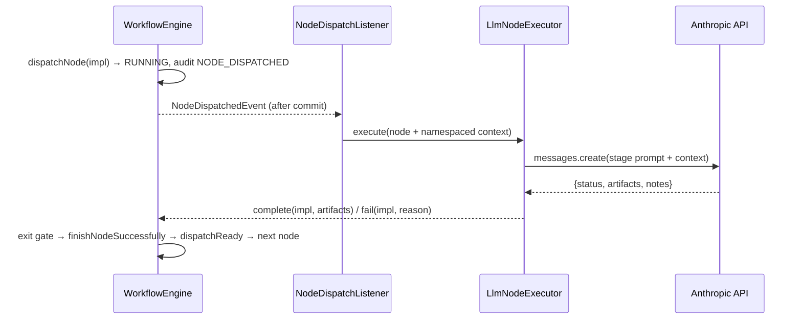
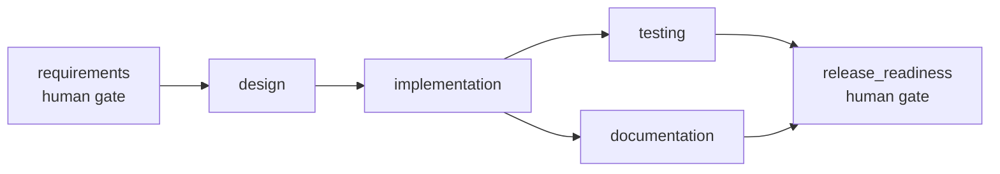
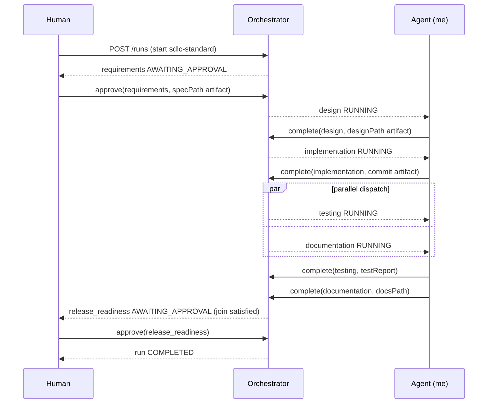

# Architecture Overview

## 1. What this system is

Two independently deployable Spring Boot services in one Maven multi-module repo:

- **`orchestrator`** (port 8081) — the agentic SDLC orchestration engine. This is the
  part the assignment actually evaluates ("the URL shortener is the payload/vehicle").
- **`url-shortener-service`** (port 8080) — the product built *through* the
  orchestrator, across three specs (`specs/001-*`, `specs/002-*`, `specs/003-*`).

Both are stateless-except-for-H2 (in-memory DB per the platform decision), independently
runnable, independently tested.

## 2. Orchestrator — Component Map

```
definition/   WorkflowDefinition, NodeDefinition (YAML-loaded, static, validated at
              startup for cycles/dangling deps), WorkflowDefinitionRegistry
domain/       WorkflowRunEntity, NodeExecutionEntity, AuditEventEntity (JPA — the
              mutable runtime state + append-only audit trail)
engine/       WorkflowEngine (all orchestration logic), exceptions
policy/       PolicyEngine (small gate DSL: requireContext / requireArtifact /
              denyIfContext), evaluated on every node's entry and exit
metrics/      MetricsService (success rate, retry/rollback frequency, MTTR, latency —
              all derived from the audit trail, nothing tracked separately)
api/          REST controllers + DTOs (the only way to interact with a run)
repository/   Spring Data JPA repositories
```

**Why definitions are YAML and runs are JPA entities, not both persisted the same way:**
a `WorkflowDefinition` is a reusable template (the SDLC shape); a `WorkflowRunEntity` is
one execution of it. Conflating them would mean re-validating/re-parsing a workflow
shape on every run. Splitting them means the DAG is validated once at startup
(`WorkflowDefinition.validate()` — Kahn's-algorithm cycle detection, dangling-dependency
checks) and every run just walks the same trusted graph.

## 3. Orchestration Model

### 3.1 Controlled autonomy: the engine coordinates, it doesn't execute

A node's SDLC work (write a spec, write code, run tests, write docs) happens *outside*
the engine's core. The engine's job is purely to decide *when* a node is allowed to run,
track its state, and enforce governance. This is the "controlled autonomy" principle from
the assignment made concrete: `WorkflowEngine` itself never does the work — it dispatches a
node to `RUNNING` (or `AWAITING_APPROVAL`) and something reports back via
`complete`/`fail`/`approve`/`reject`.

**What reports back** is a pluggable `NodeExecutor` behind the `dispatchNode` seam
(`engine/executor/`), chosen per node (`executor:` in the workflow YAML) or globally
(`orchestrator.executor.mode`):

- **`manual`** (default) — nothing runs automatically; the engine waits for an external REST
  callback (a human, or an agent driving the API by hand). This is the mode all 15 core
  engine tests are built around: zero network, fully deterministic.
- **`scripted`** — canned results, for tests and offline demos.
- **`llm`** — a real Anthropic Messages API call (`AnthropicChatPort`). Input: the node
  definition (stage, gates) plus the accumulated namespaced context. Output: an artifact map
  and a pass/fail, fed straight back through `complete`/`fail`.

The executor is just an automated stand-in for the human/agent that used to POST back —
**governance is byte-for-byte identical in every mode**: entry/exit policy gates, human
approval gates, bounded retry, fallback, rollback, the audit trail and the derived metrics
all run exactly the same whether a result came from `curl` or from a model. See §3.6.

### 3.1a Execution modes and the autonomous runner

An `autonomous: true` run (flag on `POST /runs`) lets a dispatched non-`manual` node be
picked up automatically: `dispatchNode` publishes a `NodeDispatchedEvent`, and after the
transaction commits `NodeDispatchListener` hands the node to its `NodeExecutor` on a bounded
pool, then feeds the result back through the engine's normal entry points. The "loop" is
emergent — each callback runs `dispatchReady`, which dispatches the next node, which fires
the next event — the same fix-point pattern the engine already uses, now closed over the
executor. **Human approval gates still block**: an autonomous run stops dead at
`AWAITING_APPROVAL` until a real `approve`/`reject` arrives. Autonomy stops at governance.



`docs/scenario-runs/004-autonomous-llm.json` is one such run exported end to end.

### 3.2 The DAG

`sdlc-standard.yaml`:



`testing` and `documentation` both depend only on `implementation` — once it completes,
both are dispatched in the same pass (true parallelism from the caller's point of view:
both sit in `RUNNING` simultaneously, completable in any order). `release_readiness`
depends on both, so it only becomes reachable once *both* have reported back — that join
is the "synchronization" the assignment asks for, and it falls directly out of the
dependency-satisfaction check (`depsSatisfied`), not a separate barrier mechanism.

### 3.3 Human approval checkpoints

`requirements` and `release_readiness` are marked `requiresApproval: true`. Dispatch puts
them in `AWAITING_APPROVAL` instead of `RUNNING`; only `POST .../approve` or `.../reject`
moves them out of that state. All three scenario runs (`docs/scenario-runs/*.json`) show
this: a real human-facing gate before requirements work is accepted, and again before
release.

### 3.4 Bounded retry, fallback, rollback

- **Retry**: `maxRetries` per node. `fail()` increments the attempt counter; while under
  budget, the node goes `RETRYING` → immediately redispatched.
- **Fallback**: a node can name a `fallbackNodeId`. Once retries are exhausted, the
  engine triggers that alternate node instead of failing the run outright. A fallback
  node is *gated* — `isFallbackAwaitingTrigger` prevents it from dispatching just
  because its own `dependsOn` is satisfied; it only becomes eligible once its primary
  has actually `FAILED`. (This was a real bug caught by the orchestrator's own test
  suite — see §6.)
- **Rollback**: on unrecoverable failure (retries exhausted with no fallback, an
  approval rejection, or a policy violation), `rollbackAndFailRun` walks every
  `COMPLETED` node flagged `compensation: true` in reverse order and marks it
  `ROLLED_BACK`, logging a `ROLLBACK_TRIGGERED` audit event per node.

### 3.5 Safe-stop

`pause` halts new dispatch but lets already-`RUNNING`/`AWAITING_APPROVAL` nodes keep
reporting (a hard kill mid-work is not "safe"). `resume` re-evaluates the DAG from
wherever it left off. `cancel` marks all non-terminal nodes `SKIPPED` and optionally runs
the same rollback routine before marking the run `CANCELLED`.

### 3.6 Dynamic re-planning

`POST /runs/{id}/nodes/{nodeId}/invalidate` — only legal on a `COMPLETED` node. Computes
the transitive downstream set via `WorkflowDefinition.transitiveDownstream` (BFS over
`directDependents`), marks that node plus everything downstream `STALE`, strips their
namespaced context contributions (`nodeId.artifactKey`) from the run's context, and
re-dispatches. Nodes *outside* that downstream set — including already-completed
sibling branches — are untouched, so "preserve cross-stage context" holds for the parts
of the plan that didn't change. Exercised directly in
`WorkflowEngineDiamondTest#invalidatingCompletedNode_marksTransitiveDownstreamStaleAndRedispatches`.

### 3.7 Policy guardrails

Every node's `entryGate`/`exitGate` (YAML strings) are evaluated by `PolicyEngine`
before a node may start or complete:

| Gate | Meaning |
|---|---|
| `requireContext:<key>` | run-level context must hold a non-blank value |
| `requireArtifact:<key>` | the completing node's own output artifacts must include it |
| `denyIfContext:<key>=<value>` | run context must **not** equal that value |

In `sdlc-standard.yaml` this enforces, e.g., that `implementation` cannot exit without a
`commit` artifact, and `release_readiness` cannot even *start* without `testing` having
produced a `testReport`. A gate violation is treated as a governance stop: `FAILED`
immediately, no retry, no fallback, straight to rollback — it means something upstream
is missing, not that the work should be retried.

### 3.8 Audit trail + reliability metrics

Every transition is an `AuditEventEntity` (timestamp, actor, event type, message,
rationale) — nothing is inferred after the fact. `MetricsService` derives, purely from
that log and `NodeExecutionEntity` rows:

- **Success rate** = completed / (completed + failed + cancelled)
- **Retry frequency** = Σ(attempts − 1) / total node executions
- **Rollback frequency** = rolled-back nodes / total node executions
- **MTTR** = time from the first recovery-triggering event (retry/rollback/policy-
  violation/rejection) to the run's eventual completion, averaged over runs that
  recovered
- **Latency** = per-run and aggregate wall-clock from start to completion

`GET /runs/{id}/metrics` and `GET /metrics` expose these; `docs/scenario-runs/*.json`
captures a snapshot after each of the three demo scenarios.

## 4. url-shortener-service — Component Map

```
domain/       ShortUrl, ClickEvent (JPA)
repository/   ShortUrlRepository, ClickEventRepository
service/      UrlShortenerService, Base62Codec, UrlValidator, ClickRecordingService,
              RateLimiter
api/          UrlController, RedirectController, AnalyticsController,
              GlobalExceptionHandler
config/       RateLimitInterceptor, WebMvcConfig
```

Built incrementally across the three specs, each an additive layer on the last (see
`specs/*/plan.md` §"Codebase Reasoning" in specs 002/003 for the explicit brownfield
impact analysis):

- **001** (greenfield): `ShortUrl`, sequence-derived Base62 codes, create/resolve/
  metadata endpoints.
- **002** (brownfield): `ClickEvent` (deliberately not a JPA relation to `ShortUrl` —
  keeps hot-link writes off the read-heavy `ShortUrl` row), async click recording,
  in-memory token-bucket rate limiter on the write path only.
- **003** (ambiguous → ambiguity resolved with a human before design): optional
  `customAlias` (validated, collision-checked, reserved-word-blocked), soft-expire
  enforcement on the redirect path only.

## 5. Control Flow — One Scenario End to End



## 6. Key Decisions & Why

| Decision | Alternative considered | Why this way |
|---|---|---|
| Work reaches nodes through a pluggable `NodeExecutor` seam; `manual` is the default | Engine hard-wired to call an LLM per node | Default `manual` keeps the 15 core engine tests deterministic and network-free. An opt-in `llm` executor (`executor: llm`, or `orchestrator.executor.mode=llm`) plugs a real model into the same `dispatchNode` seam — gates, approvals, retry/fallback/rollback, audit and metrics are identical in both modes (§3.1, §3.1a). Proven end to end in `docs/scenario-runs/004-autonomous-llm.json` |
| Definitions in YAML, runs in JPA | Both in JPA, or both as code | Templates are reusable and reviewable as plain config; runs need audit-grade persistence and query support JPA gives for free |
| Parallel dispatch via shared-dependency readiness, not an explicit fork/join primitive | A dedicated `ParallelGroup` construct | The DAG already expresses it — two nodes with the same completed dependency naturally both become ready in the same pass; adding a separate primitive would be redundant machinery |
| Fallback nodes gated on primary failure | Let fallback nodes dispatch whenever their own deps are satisfied | The naive version was actually implemented first and caught by `WorkflowEngineDiamondTest` — see the bug note below |
| Sequence-derived Base62 short codes | Random 7-char + collision-retry loop | No retry loop needed, no practical minimum-uniqueness math to get wrong; enumerability is an accepted, documented trade-off in the absence of an auth model (`specs/001-core-url-shortener/plan.md` §3) |
| Click events in their own table, not a counter column on `ShortUrl` | Increment a `clickCount` column on `ShortUrl` per click | Keeps write-heavy click recording off the row `POST /api/urls` also reads/writes; async off the redirect's critical path either way |
| In-memory rate limiter | Redis-backed shared bucket | Single-instance prototype; documented as a known limitation, not silently ignored (`specs/002-*/plan.md` §4) |
| Soft-expire (410, row kept) over hard-delete sweep | Scheduled job purging expired rows | No traffic to justify a scheduler in a prototype; keeps analytics queryable past expiry; a human explicitly chose this via `AskUserQuestion` before design started |

**Bugs the test suite actually caught** (both fixed before any scenario was run against
them — see `orchestrator/src/main/java/.../engine/WorkflowEngine.java` and the commit
history):
1. `maybeCompleteRun` originally required every node to be `COMPLETED`/`SKIPPED`,
   which meant a run that recovered via a fallback path (fallback `COMPLETED`, primary
   still `FAILED`) could never reach `COMPLETED`.
2. Fallback nodes were dispatching the moment their own `dependsOn` was satisfied,
   regardless of whether their primary node had actually failed — meaning a fallback
   node could sit in `RUNNING` forever, permanently blocking run completion, even when
   the primary succeeded on the first try.

Both are exactly the kind of governance-logic bug a "trust the LLM's first draft" review
would miss, and exactly what the orchestrator's own dedicated test suite exists to catch.
